# 啟用自動寄信

本專案支持以gmail自動寄信，在創造事件等API可以結合自動寄信的功能。當要啟用此功能時，需要設定Goole *OAuth 2* *[1]* 相關功能，以及修改本專案的設定檔。

## 步驟

### 1. 在Google APIs Console註冊應用程式

* 進入[Google APIs Console](https://code.google.com/apis/console/)，將會看到以下畫面
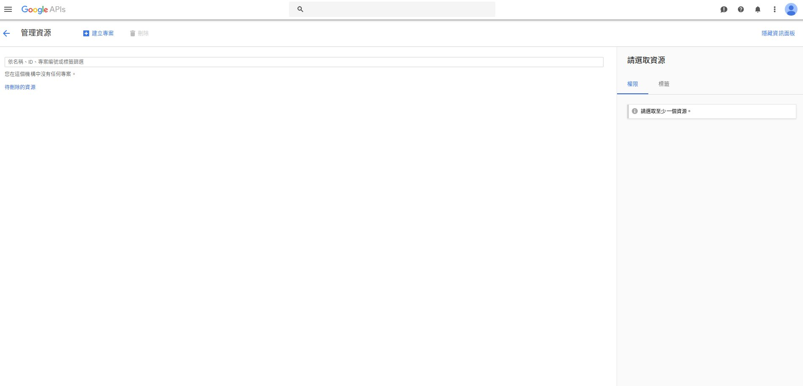

* 按下左上角的選單按鈕，並且選擇*API和服務* -> *憑證*
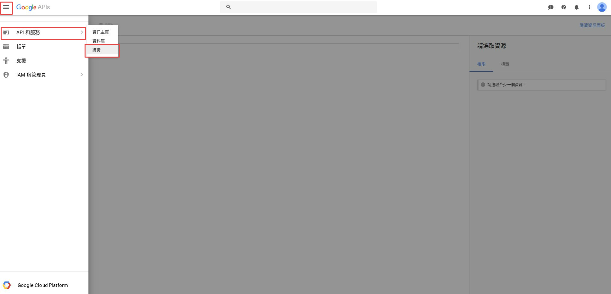

* 在憑證頁面，按下*建立*按鈕來建立新專案
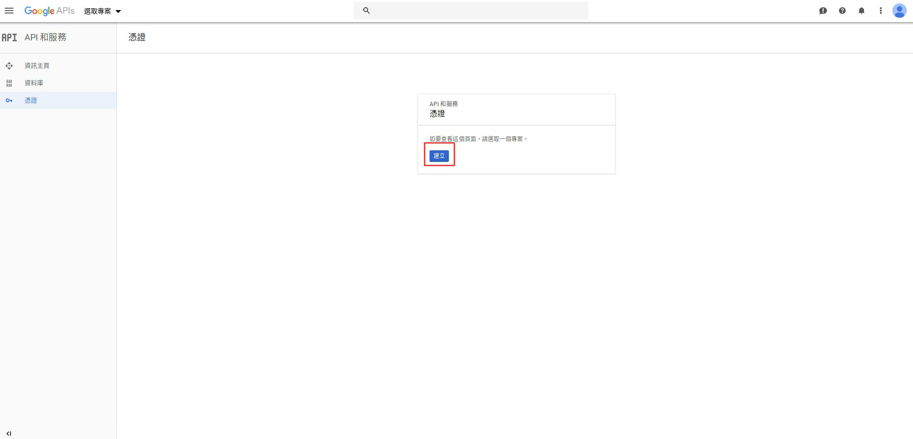

* 輸入專案名稱，並且按下*建立*按鈕
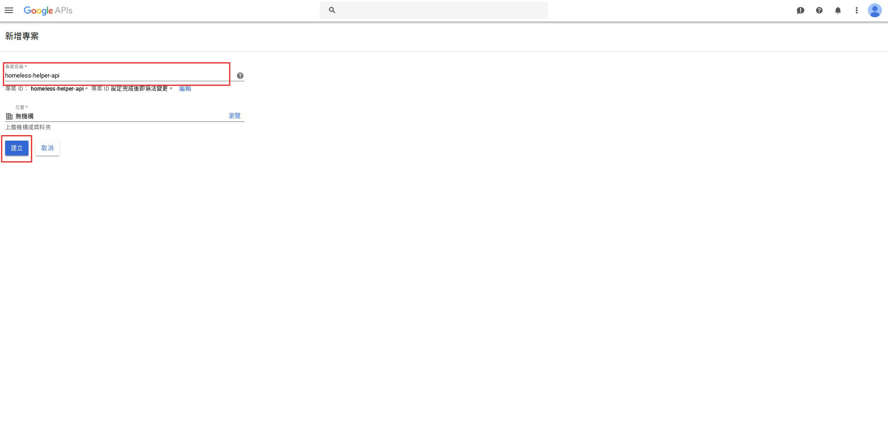

* 回到憑證頁面，按下*OAuth 同意畫面*
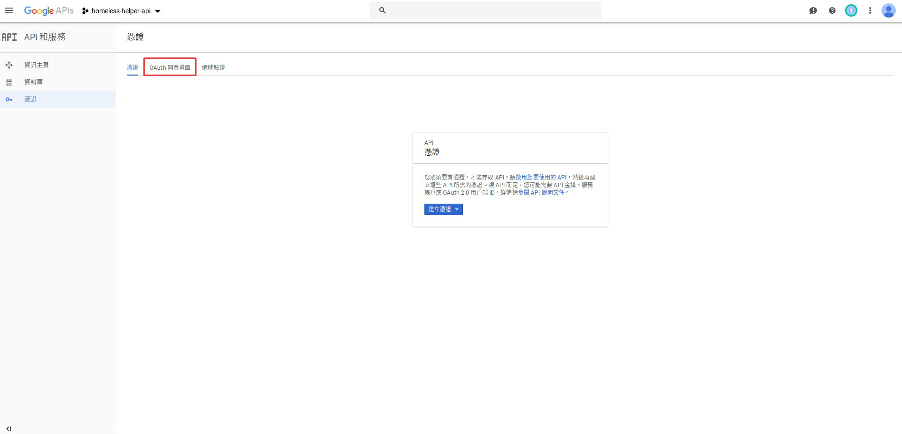

* 輸入*向使用者顯示的產品名稱*
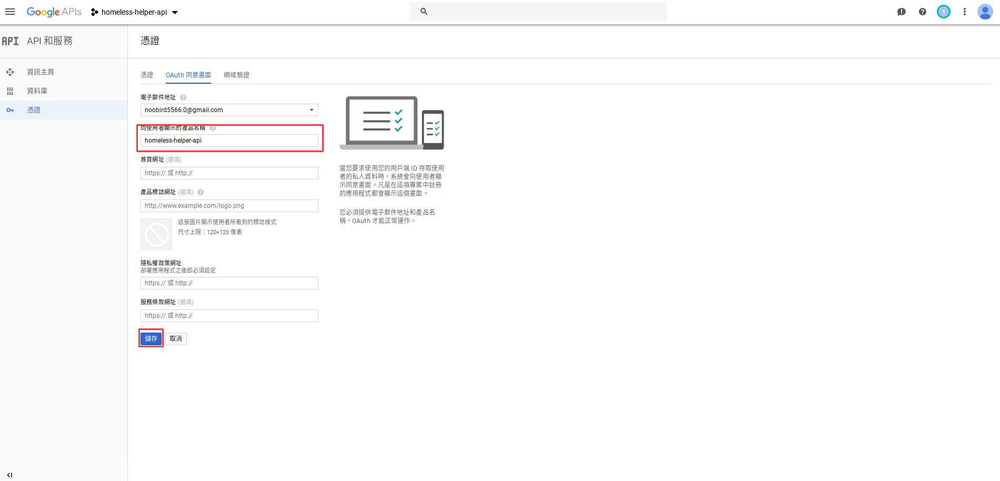

* 回到憑證頁面，按下*建立憑證* -> *OAuth 用戶端 ID*，以建立 OAuth 用戶端 ID
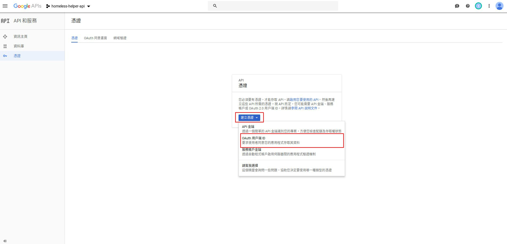

* *應用程式類型*選擇`網路應用程式`，再來輸入自訂的*名稱*，最後在*已授權的重新導向 URI*輸入`https://developers.google.com/oauthplayground`。完成後，按下*建立*按鈕
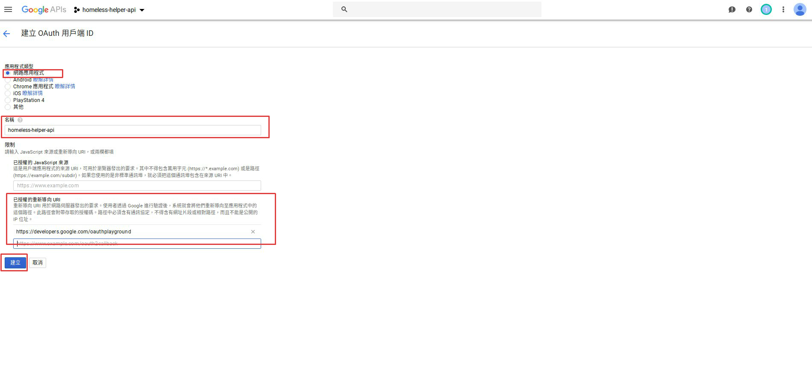

* 接下來將會取得**clientId**(上)以及**clientSecret**(下)
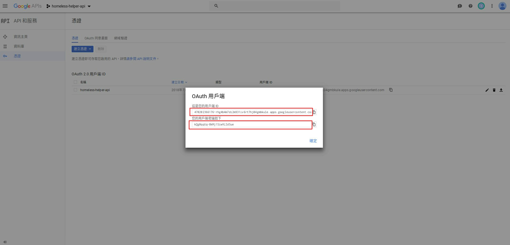

### 2. 取得Token

* 進入[Google OAuth 2.0 Playground]( https://developers.google.com/oauthplayground)，將會看到以下畫面
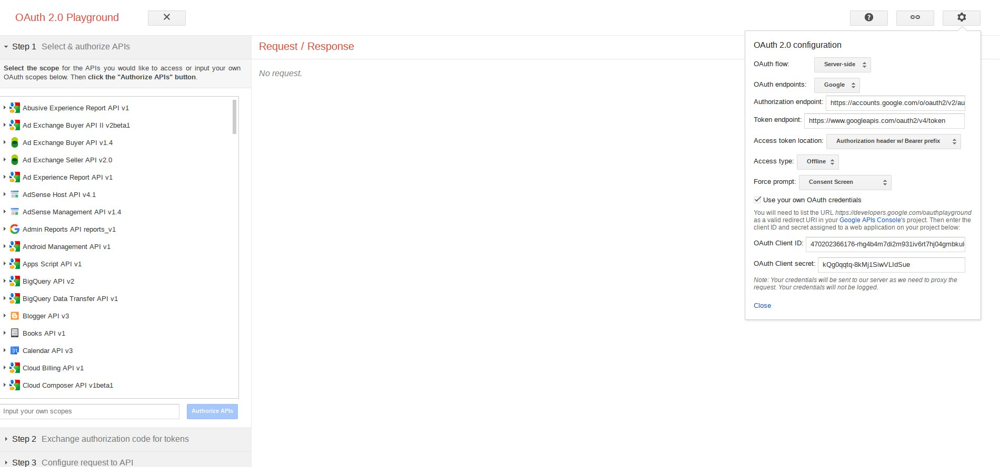

* 點選右上角的設定按鈕，在*Access token location*選擇`Authorization header w/ Bearer prefix`，*Access type*選擇`offline`，勾選*Use your own OAuth credentials*，並在*OAuth Client ID*輸入**clientId**、*OAuth Client secret*輸入**clientSecret**，最後按下*close*按鈕
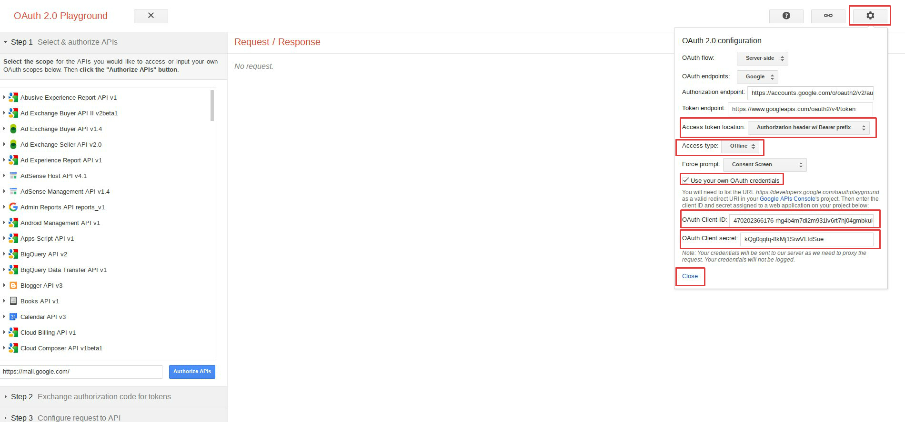

* 在左下角的API欄位輸入`https://mail.google.com/`，按下*Authorize API*，並且按照指示同意授權
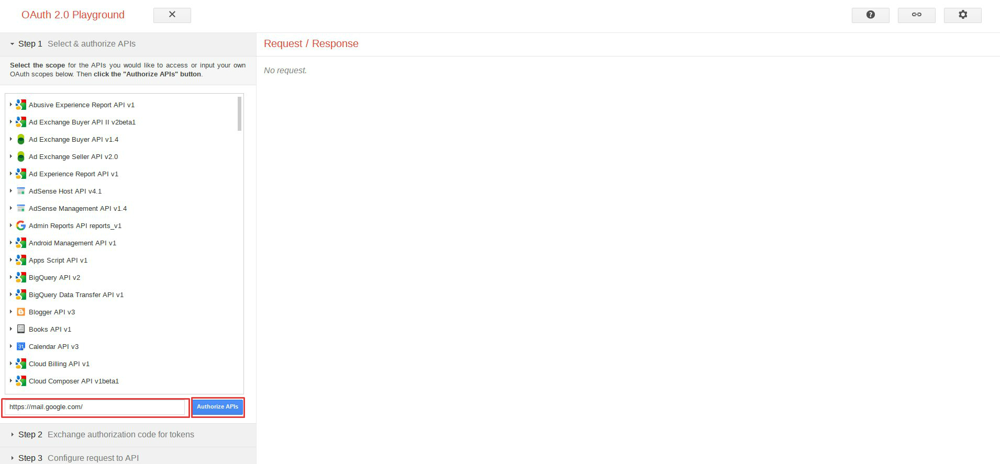

* 接下來會跳到Step 2，按下*Exchange authorization code for tokens*後，取得**refreshToken**
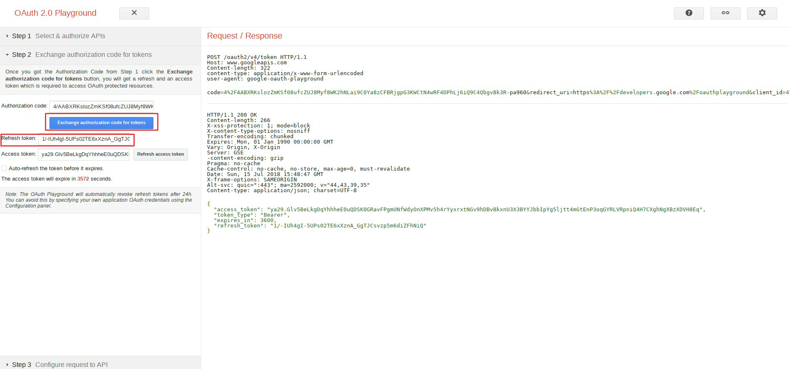

### 3. 修改專案設定檔

編輯`config.js`中的*mailer*設定，將*enabled*設定為`true`，填上**account**(gmail帳號)以及上面步驟取得的**clientId**、**clientSecret**以及**refreshToken**

```diff
const config = {
  /* 其他設定 */
  mailer: {
-    enabled: false,
+    enabled: true,
-    account: 'your-account@gmail.com',
+    account: '你的gmail帳號',
-    clientId: 'your-client-id.apps.googleusercontent.com',
+    clientId: '步驟1取得的clientId',
-    clientSecret: 'your-client-secrect',
+    clientSecret: '步驟1取得的clientSecrect',
-    refreshToken: 'your-refresh-token',
+    refreshToken: '步驟2取得的refreshToken',
  },
  /* 其他設定 */
};
```

---

*[1] OAuth with gmail 主要參考 http://masashi-k.blogspot.com/2013/06/sending-mail-with-gmail-using-xoauth2.html*